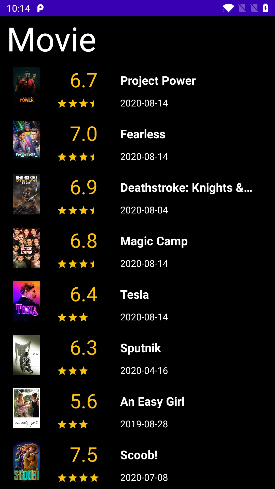

# Introduction
The Movie App uses the TMDB Trending API.
This app uses the following Android Architecture:
- ViewModel
- Livedata
- Hilt
- Coroutines
- Retrofit
- Navigation

# Screenshot

# Future Development
- Enhance Movie Detail page
- Switch Language